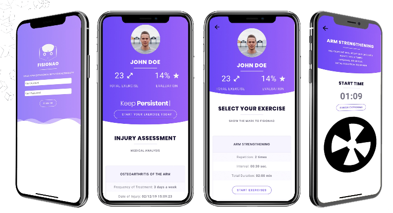

## FISIONAO APP

Application with integration in NAO Robot to physiotherapy theme.

Class: TAMI (TÓPICOS AVANÇADOS EM MÍDIA E INTERAÇÃO 2)

Students Name: Sotero Jr., Sthefanie, Mozart Jr. and Anny Caroliny.

Students Emails: {srsj2,sdm2,mmaj,acsv2}@cin.ufpe.br

Project Created: 2019-05-20

### USED TECHNOLOGIES:

`Flutter v1.2.1`

`PHP 7 Scripts`

`Google Cloud Plataform Firebase`

`API Gmail`

`Version Android and iOS`

### SCREENSHOTS:

